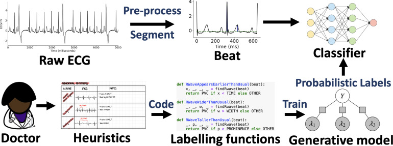
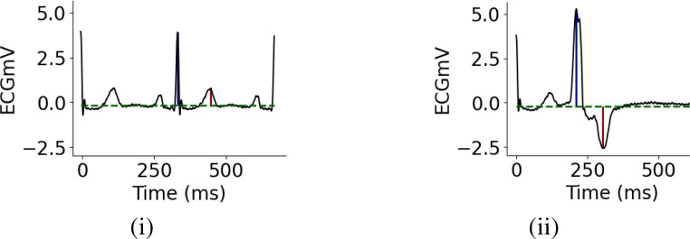

# MIT-BIH Arrhythmia Detection

## Background
Electrocardiograms (ECGs) represent a cost-effective, non-invasive yet powerful diagnostic tool for heart disease. While machine learning has shown promise in automating ECG analysis, current approaches rely heavily on large, manually annotated datasets. The point-by-point annotation of abnormal heartbeats is time-consuming, tedious, and expensive - creating a significant bottleneck in developing robust detection systems.

### Challenge Overview
This competition focuses on the critical problem of efficiently labeling abnormal heartbeats using expert-designed heuristics and programmatic weak supervision through the Data Programming framework. Your task is to leverage this approach to identify Premature Ventricular Contractions (PVCs) - a specific type of cardiac arrhythmia.

### Clinical Significance
While isolated, infrequent PVCs are generally benign, frequent occurrences with exceptionally wide QRS complexes may indicate underlying heart disease and potentially lead to sudden cardiac death. Accurate PVC detection can provide critical early warnings for at-risk patients.

### Technical Approach
You will:

- Implement six domain expert-defined heuristics as Labeling Functions (LFs)
- Use Snorkel, an open-source library, to model these heuristics within a factor graph framework
- Generate probabilistic labels for each heartbeat instance

This competition explores the frontier of medical ML by focusing on the labeling methodology rather than just model development. By demonstrating effective programmatic weak supervision techniques, you'll help address a key bottleneck in medical AI: the reliance on expensive manual annotations.

## Data Description
The MIT-BIH Arrhythmia Database contains 48 half-hour excerpts of two-channel ambulatory ECG recordings, obtained from 47 subjects studied by the BIH Arrhythmia Laboratory between 1975 and 1979. Twenty-three recordings were chosen at random from a set of 4000 24-hour ambulatory ECG recordings collected from a mixed population of inpatients (about 60%) and outpatients (about 40%) at Boston's Beth Israel Hospital; the remaining 25 recordings were selected from the same set to include less common but clinically significant arrhythmias that would not be well-represented in a small random sample.

# ECG Classification Challenge: Weak Supervision for Arrhythmia Detection

## Challenge Overview

Your task is to develop an algorithm that can accurately classify each heartbeat from ECG signals into one of two classes:
- Normal beats (N)
- Premature Ventricular Contractions (PVC)

**The key challenge:** The training data is completely unlabeled. Instead of using hand-labeled data, you must implement a weak supervision approach using domain-specific heuristics to programmatically generate probabilistic labels.

## Weak Supervision Methodology

We provide a framework based on the work by Goswami et al. [1] that shows how to use medical domain knowledge to programmatically label ECG data without manual annotation.



*Figure 1: Data programming with time series heuristics can affordably train competitive end models for automated ECG adjudication. Instead of labeling each data point by hand (fully supervised setting), experts encode their domain knowledge using noisy labeling functions (LFs). A label model then learns the unobserved empirical accuracy of LFs and uses them to produce probabilistic data label estimates using weighted majority vote.*

### Modeling Approach

Given an ECG dataset of p patients $X = \{x_j\}^p_{j=1}$, where $x_j \in \mathbb{R}^T$ are raw ECG vectors of length T, we can segment each ECG $x_j$ into B < T beats such that $x_j = \{x^1_j,...,x^B_j\}$. Each segment b ∈ {1,..., B} has an unknown class label $y_b \in \{-1,1\}$, where $y^b_j = 1$ represents a premature ventricular contraction (PVC).

We define m labeling functions (LFs) $\{\lambda_h(x^b_j)\}^m_{h=1}$ directly on the time series. These LFs noisily label subsets of beats with $\lambda_h(x^b_j) = \{−1, 0, 1\}$ corresponding to votes for negative, abstain, or positive. These functions do not have to be perfect and may conflict on some samples, but must have accuracy better than random.

The label model learns to combine these noisy sources using a factor graph that estimates each labeling function's accuracy and propensity to vote. The mathematical model is defined as:

$$p_\theta(Y_j, \Lambda_j) \triangleq Z^{-1}_\theta \exp(\sum^B_{i=1}\sum^m_{k=1}\theta_k\phi^{Acc}_{i,k}(\Lambda^i_j, y^i_j) + \sum^B_{i=1}\sum^m_{k=1}\theta_k\phi^{Lab}_{i,k}(\Lambda^i_j, y^i_j))$$

Where:
- $\phi^{Acc}_{i,k}(\Lambda, Y) \triangleq \mathbb{1} \{\Lambda_{i,k} = y_i\}$ (accuracy factor)
- $\phi^{Lab}_{i,k}(\Lambda, Y) \triangleq \mathbb{1} \{\Lambda_{i,k} \neq 0\}$ (propensity factor)

**Important Note:** In this challenge, we will only focus on labeling the dataset using Snorkel, an open-source library for programmatic weak supervision.

## Understanding PVCs

A Premature Ventricular Contraction is a common arrhythmia where the heartbeat is initiated by an impulse from an ectopic focus in the ventricles rather than the sinoatrial node.



*Figure 2: Examples of a normal (i) and PVC (ii) heartbeat. Dotted green horizontal lines represent the ECG baselines detected during pre-processing, blue and red vertical lines mark the QRS-complexes and T-waves.*

### Key ECG Characteristics of PVCs:

On an ECG, a PVC beat typically shows:
1. Earlier appearance than normal beats
2. Abnormally tall and wide QRS-complex
3. ST-T vector directed opposite to the QRS vector

## Implementing Labeling Functions

Based on these characteristics, we can implement six key heuristics as labeling functions:

1. R-wave appears earlier than usual
2. R-wave is taller than usual
3. R-wave is wider than usual
4. QRS-vector is directed opposite to the ST-vector
5. QRS-complex is inverted
6. Inverted R-wave is taller than usual


*Example Python code for LFWide R-wave and LFEarly R-wave. The findRwaveWidth() and findRwave() sub-routines return the precise width and positions of the R-wave in a beat, while the variables WIDTH_RWAVE and TIME_RWAVE_APPEARS_EARLIER reflect the thresholds T_Wide R-wave and T_Early R-wave.*

The following figure shows the different parts of an ECG, taken from
https://geekymedics.com/understanding-an-ecg/:


### Implementation Details

To implement these heuristics effectively:
1. **Signal Pre-processing**: Begin by removing baseline wandering using a forward/backward, fourth-order high-pass Butterworth filter.
2. **Heartbeat Segmentation**: Segment ECG signals into individual beats by considering the time between alternate QRS-complexes as a heartbeat.
3. **Feature Extraction**: Determine precise locations of QRS-complexes and T-waves using peak finding algorithms and RANSAC for baseline detection.
4. **Threshold Determination**: For each heuristic, determine appropriate thresholds. For example, to identify an "early R-wave", use the Minimum Covariance Determinant algorithm to find the covariance of the most-normal subset of the frequency histogram, then set the threshold at 2 standard deviations from the estimated mean.
5. **Patient-Specific Calibration**: To account for inter-patient variability, compute subject-specific thresholds for each heuristic automatically.

You **MUST** use Snorkel to aggregate labeling function outputs. To install Snorkel, we recommend using pip:
```bash
pip install snorkel
```

## File Descriptions

### train_features.csv
- Contains unlabeled ECG heartbeat segments that participants must classify
- Each heartbeat is represented as a 256-point time series from modified limb lead II (MLII) ECG recordings
- All signals have been preprocessed and normalized for consistency
- File structure:
  - Column 1: Unique heartbeat identifier (ID)
  - Columns 2-257: Time series values representing a single heartbeat waveform

### sample_submission.csv
- Submission template with the required format:
  - **Id**: Unique heartbeat identifier matching train_features.csv
  - **Normal**: Probability (0-1) that the heartbeat is normal
  - **PVC**: Probability (0-1) that the heartbeat is a Premature Ventricular Contraction

*Note: Probabilities must sum to 1.0 for each heartbeat*

### Snorkel Resources
The following resources are provided to help you effectively use Snorkel for labeling:

#### snorkel/
- Complete Snorkel library codebase for programmatic data labeling

#### 01_spam_tutorial.py
- Introductory tutorial demonstrating Snorkel's core functionality
- Walks through creating and evaluating labeling functions for YouTube comment spam classification
- Serves as a practical example of Snorkel's workflow that you can adapt for ECG classification

#### Documentation
- **snorkel-docs.pdf/txt**: Complete Snorkel documentation in both formats
- **snorkel-labeling-docs.txt**: Focused documentation specifically on Snorkel's labeling package, which is the primary component needed for this challenge

*Tip: We recommend starting with the spam tutorial to understand Snorkel's fundamentals before applying similar techniques to ECG classification.*

## Evaluation
Submissions will be evaluated based on how accurately your programmatically generated labels match the hidden ground truth labels. Specifically:

- Your weak supervision approach should generate probability scores for each heartbeat (e.g., probability of being a PVC vs. normal)
- These probabilistic labels will be converted to binary classifications by assigning each heartbeat to the class with the higher probability score
- Your final score will be calculated by comparing these binary classifications against expert-annotated ground truth labels

$\text{TrainingAccuracy} = \frac{1}{N_{train}} \sum_{i=1}^{N_{train}} \mathbb{1}(\hat{y}_i = y_i)$

Where:
$N_{train}$ is the number of training samples
$\hat{y}_i$ is your predicted label for sample $i$
$y_i$ is the ground truth label for sample $i$
$\mathbb{1}$ is the indicator function that equals 1 when $\hat{y}_i = y_i$ and 0 otherwise

## Submission Requirements

### submission.csv
- A single CSV file containing:
  - **Id**: Unique identifier for each ECG heartbeat
  - **Normal**: Probability (0-1) that the heartbeat is normal
  - **PVC**: Probability (0-1) that the heartbeat is a Premature Ventricular Contraction

### Important Rules
- You **MUST** use the provided heuristics and programmatic weak supervision approach
- Manual labeling is **STRICTLY PROHIBITED**
- All probability labels must be generated using only the weak supervision methodology outlined in the challenge
- Submissions showing evidence of manual labeling will be disqualified

### Format Reference
- See **sample_submission.csv** for the correct submission format template

*Note: All probability values should sum to 1 for each heartbeat.*

## References

When using this resource, please cite the original publications:
1. Goswami, Mononito, Benedikt Boecking, and Artur Dubrawski. "Weak supervision for affordable modeling of electrocardiogram data." AMIA Annual Symposium Proceedings. Vol. 2021. 2022.
2. Moody GB, Mark RG. The impact of the MIT-BIH Arrhythmia Database. IEEE Eng in Med and Biol 20(3):45-50 (May-June 2001). (PMID: 11446209)

Please include the standard citation for PhysioNet:
- Goldberger, A., Amaral, L., Glass, L., Hausdorff, J., Ivanov, P. C., Mark, R., ... & Stanley, H. E. (2000). PhysioBank, PhysioToolkit, and PhysioNet: Components of a new research resource for complex physiologic signals. Circulation [Online]. 101 (23), pp. e215–e220.

### Additional References
1. Mark RG, Schluter PS, Moody GB, Devlin, PH, Chernoff, D. An annotated ECG database for evaluating arrhythmia detectors. IEEE Transactions on Biomedical Engineering 29(8):600 (1982).
2. Moody GB, Mark RG. The MIT-BIH Arrhythmia Database on CD-ROM and software for use with it. Computers in Cardiology 17:185-188 (1990).
3. Ratner, Alexander, et al. "Snorkel: Rapid training data creation with weak supervision." Proceedings of the VLDB endowment. International conference on very large data bases. Vol. 11. No. 3. 2017.
